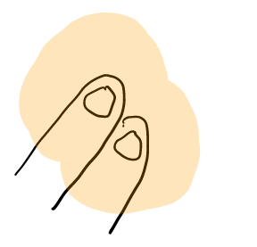

# MemoTube
MemoTube is a video player app that allows users to take notes while they are watching a video.
It works on Android version 4.4 (Kitkat) or above. It was designed for and tested on 9.6 inch tablet(Samsung Galaxy Tab E SM-T560). For more, see our <a href="https://github.com/evakok/memotube/blob/Final/report-memotube.pdf">documentation</a>.

# How to use
Install with APK file. Upon opening, first choose a video file to play. You can either select what is stored on the device, or simply select the demo video. Make sure the device is connected to the internet to play the demo.

To start the note-taking mode, place your two non-dominant fingers on the screen.

Use your dominant finger to take notes. The memo will be saved to 'Memotube' folder after you lift off the all fingers. The folder is placed on the root of your device storage.

Click the pencil button to change the color or width of the pen.

Slide from the left to open the bookmark list.

Click on one bookmark item to view the memo on top of the video.

## DEMO Video

### Team members:
* Hiyeon Kim - 118654
* Evangelia Eirini Koktsidou - 118884

## Credits
Button icons were taken from [Flaticon](www.flaticon.com) and are all licensed by [Creative Commons BY 3.0](http://creativecommons.org/licenses/by/3.0/)

* Folder, Exit - made by [Smashicons](https://www.flaticon.com/authors/smashicons)
* Bunny - made by [Freepik](http://www.freepik.com)
* Edit - made by [Chanut](https://www.flaticon.com/authors/chanut)

## Attribution
* [ExoPlayer](https://google.github.io/ExoPlayer/) - [Apache 2.0](http://www.apache.org/licenses/LICENSE-2.0)
* [Android Draw](https://github.com/divyanshub024/AndroidDraw) - [Apache 2.0](http://www.apache.org/licenses/LICENSE-2.0)

